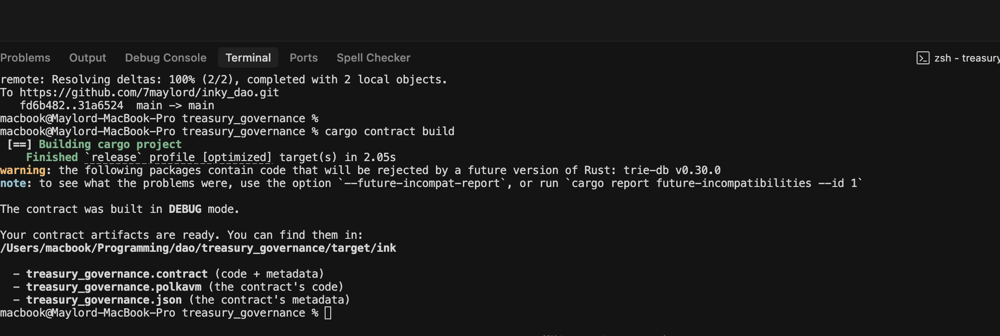

# Treasury Governance Contract

A comprehensive DAO governance contract built with ink! for the Polkadot ecosystem, enabling decentralized decision-making through proposal creation, voting, and execution.

## Contract Images

### Architecture Overview


### Governance Flow


## Contract Overview

The Treasury Governance contract provides a complete governance framework for DAOs, allowing registered voters to create proposals, vote on them, and execute approved decisions. It supports multiple proposal types, configurable voting periods, quorum thresholds, and execution delays.


## Testing

Run tests with:
```bash
cargo test
```

## Building

Build the contract with:
```bash
cargo contract build
```

## License

This project is licensed under the MIT License.
